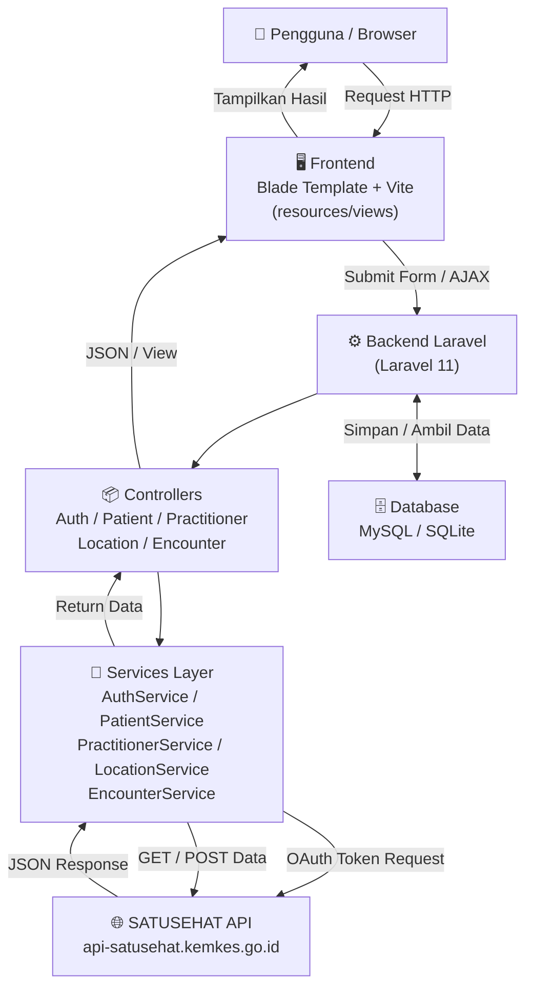
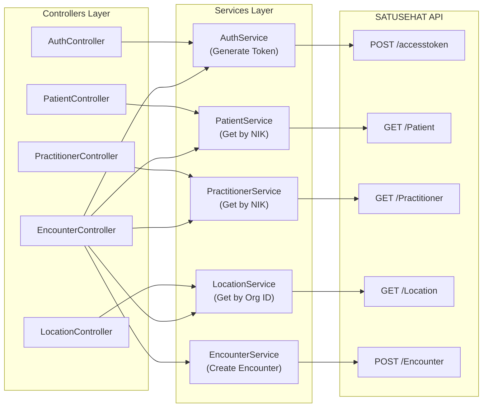
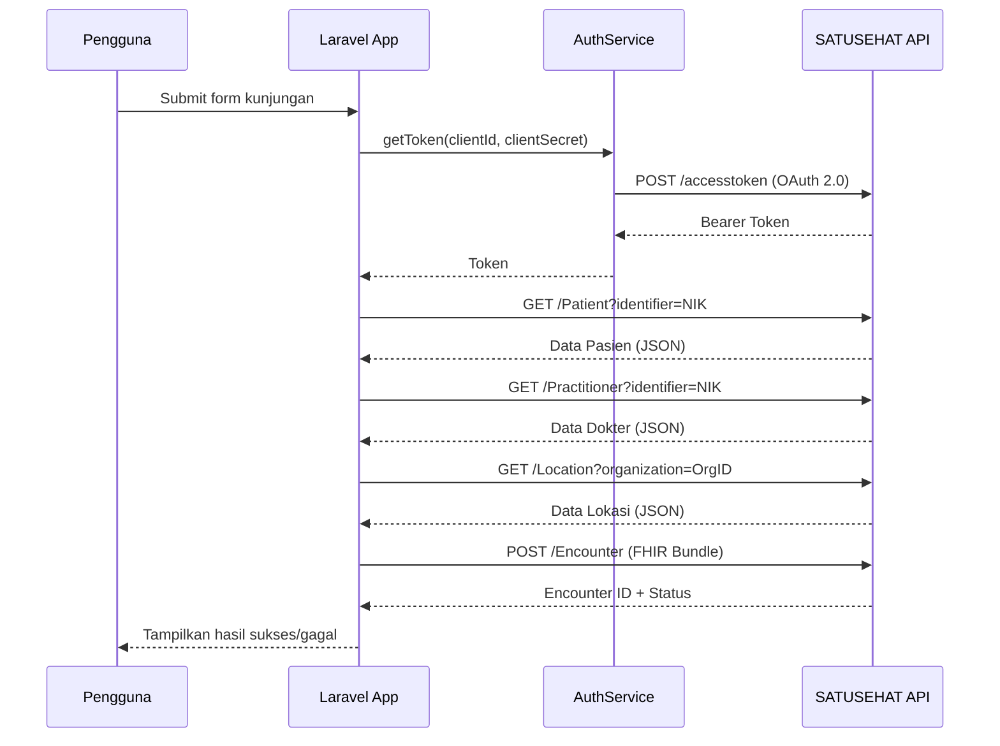
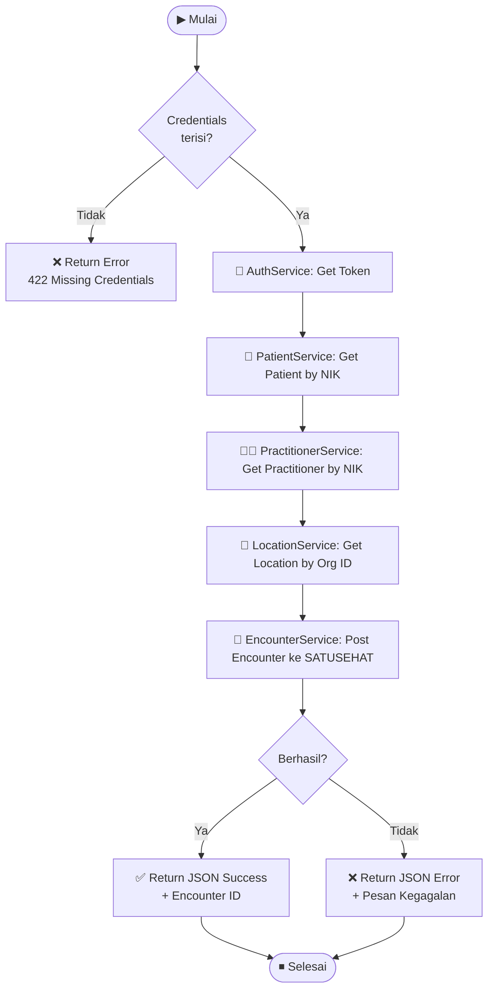

# 📋 Dokumentasi Proyek SatuSehat

## 📑 Daftar Isi

1. [Tentang Proyek](#1-tentang-proyek)
2. [Tech Stack](#2-tech-stack)
3. [Struktur Direktori](#3-struktur-direktori)
4. [Arsitektur Sistem](#4-arsitektur-sistem)
   - 4.1 [Diagram Alur Sistem](#41-diagram-alur-sistem)
   - 4.2 [Komponen Backend](#42-komponen-backend)
   - 4.3 [Integrasi SATUSEHAT API](#43-integrasi-satusehat-api)
   - 4.4 [Alur Data Encounter](#44-alur-data-encounter)
5. [Endpoint API](#5-endpoint-api)
6. [Pembagian Kelompok & Job Description](#6-pembagian-kelompok--job-description)
   - 6.1 [Tim Frontend (4 Orang)](#61-tim-frontend-4-orang)
   - 6.2 [Tim Backend (4 Orang)](#62-tim-backend-4-orang)
7. [Cara Menjalankan Proyek](#7-cara-menjalankan-proyek)

---

## 1. Tentang Proyek

**SatuSehat** adalah aplikasi berbasis web yang mengintegrasikan sistem informasi kesehatan dengan platform **SATUSEHAT** milik Kementerian Kesehatan Republik Indonesia. Proyek ini memungkinkan pengguna untuk:

- Mengautentikasi dan mendapatkan token dari API SATUSEHAT
- Mengambil data **Pasien** (Patient) berdasarkan NIK
- Mengambil data **Praktisi/Dokter** (Practitioner) berdasarkan NIK
- Mengambil data **Lokasi/Faskes** (Location) berdasarkan kode organisasi
- Membuat dan mengirim data **Kunjungan/Encounter** ke SATUSEHAT

---

## 2. Tech Stack

| Layer | Teknologi |
|---|---|
| **Backend Framework** | Laravel 11 (PHP) |
| **Frontend View** | Blade Template + Vite |
| **Styling** | CSS / Tailwind |
| **Database** | MySQL / SQLite |
| **HTTP Client** | Laravel HTTP (via `Http::post()`) |
| **API Target** | SATUSEHAT Sandbox API |
| **Testing** | PHPUnit |
| **Dev Tools** | Composer, NPM, Artisan |
| **Dokumentasi API** | Postman Collection |

---

## 3. Struktur Direktori

```
satusehatt/
├── app/
│   ├── Http/
│   │   └── Controllers/
│   │       ├── AuthController.php          # Controller autentikasi
│   │       ├── Controller.php              # Base controller
│   │       ├── EncounterController.php     # Controller kunjungan medis
│   │       ├── LocationController.php      # Controller lokasi/faskes
│   │       ├── PatientController.php       # Controller data pasien
│   │       └── PractitionerController.php  # Controller data dokter
│   ├── Models/
│   │   └── User.php                        # Model user
│   ├── Providers/
│   │   └── AppServiceProvider.php
│   └── Services/
│       ├── AuthService.php                 # Service token SATUSEHAT
│       ├── EncounterService.php            # Service buat encounter
│       ├── LocationService.php             # Service ambil data lokasi
│       ├── PatientService.php              # Service ambil data pasien
│       └── PractitionerService.php         # Service ambil data dokter
├── bootstrap/
│   └── app.php
├── config/
│   ├── app.php
│   ├── auth.php
│   ├── database.php
│   └── ...
├── database/
│   ├── factories/
│   ├── migrations/
│   └── seeders/
├── postman/
│   ├── SATUSEHAT.postman_collection.json   # Koleksi Postman lengkap
│   └── SATUSEHAT Sandbox.postman_environment.json
├── public/
│   └── index.php
├── resources/
│   ├── css/
│   │   └── app.css
│   ├── js/
│   │   └── app.js
│   └── views/
│       └── welcome.blade.php               # Halaman utama
├── routes/
│   ├── api.php                             # Rute API
│   ├── console.php
│   └── web.php
├── screenshots/                            # Screenshot hasil testing
│   ├── encounter-success.png
│   ├── generate-token.png
│   ├── location-success.png
│   ├── patient-response.png
│   └── practitioner-response.png
├── tests/
├── .env.example
├── composer.json
├── package.json
└── vite.config.js
```

---

## 4. Arsitektur Sistem

### 4.1 Diagram Alur Sistem



### 4.2 Komponen Backend



### 4.3 Integrasi SATUSEHAT API



### 4.4 Alur Data Encounter



---

## 5. Endpoint API

| Method | Endpoint | Controller | Deskripsi |
|--------|----------|------------|-----------|
| `POST` | `/api/encounter` | `EncounterController@store` | Mengirim data kunjungan medis lengkap ke SATUSEHAT |

> **Catatan:** Endpoint utama adalah `/api/encounter` yang secara internal memanggil seluruh chain: Auth → Patient → Practitioner → Location → Encounter.

**Body Request (JSON):**
```json
{
  "patient_nik": "3201234567890001",
  "practitioner_nik": "3201234567890002",
  "encounter_date": "2025-01-01",
  "encounter_notes": "Catatan kunjungan pasien"
}
```

**Response Sukses:**
```json
{
  "success": true,
  "message": "Encounter berhasil dibuat",
  "encounter_id": "enc-xxxxxxxx"
}
```

---

## 6. Pembagian Kelompok & Job Description

> Total anggota: **8 orang** → dibagi menjadi **4 Frontend** dan **4 Backend**

---

### 6.1 Tim Frontend (4 Orang)

#### 👤 Siti — UI/UX Designer & Layout Lead
**Fokus:** Desain tampilan utama & pengalaman pengguna

| Tugas | Detail |
|-------|--------|
| 🎨 Desain UI | Merancang wireframe & mockup halaman (welcome, form, hasil) |
| 🏗️ Layout Blade | Membuat struktur `resources/views/welcome.blade.php` & layout utama |
| 🎭 Styling | Mengatur `resources/css/app.css`, tema warna, tipografi |
| 📱 Responsif | Memastikan tampilan responsif di berbagai ukuran layar |
| 🔗 Link Navigasi | Membuat navigasi antar halaman / komponen UI |

---

#### 👤 Nadhira — Form & Input Handler
**Fokus:** Form pengisian data dan validasi sisi klien

| Tugas | Detail |
|-------|--------|
| 📝 Form Encounter | Membuat form input data pasien, dokter, tanggal, catatan |
| ✅ Validasi Client | Implementasi validasi input sebelum dikirim ke server |
| 🔒 CSRF Token | Memastikan form menggunakan proteksi CSRF Laravel |
| 📋 Form State | Mengelola state form (loading, error, success) |
| 🎯 UX Feedback | Menambahkan feedback visual saat user berinteraksi dengan form |

---

#### 👤 Gurveen — JavaScript & Integrasi API
**Fokus:** Logika JavaScript dan komunikasi dengan backend

| Tugas | Detail |
|-------|--------|
| 📡 AJAX / Fetch | Menulis kode `fetch()` / `axios` untuk kirim data ke `/api/encounter` |
| 🔄 Loading State | Menampilkan spinner / skeleton saat menunggu respons API |
| 📊 Tampilkan Hasil | Parsing dan menampilkan response JSON dari backend |
| ⚠️ Error Handling | Menampilkan pesan error yang ramah pengguna |
| 🔧 Vite Config | Mengurus `vite.config.js` dan `resources/js/app.js` |

---

#### 👤 Taqi — Screenshot, Testing & Dokumentasi Frontend
**Fokus:** QA frontend, dokumentasi tampilan, dan screenshot

| Tugas | Detail |
|-------|--------|
| 📸 Screenshot | Mengambil screenshot hasil fitur (`screenshots/*.png`) |
| 🧪 Manual Testing | Melakukan uji coba manual tampilan di berbagai browser |
| 📖 Dokumentasi UI | Mendokumentasikan cara penggunaan antarmuka |
| 🐛 Bug Report | Mencatat dan melaporkan bug tampilan ke tim BE |
| 🔗 Integrasi | Memastikan tampilan terhubung baik dengan endpoint backend |

---

### 6.2 Tim Backend (4 Orang)

#### 👤 Riris — Auth & Environment Setup
**Fokus:** Autentikasi SATUSEHAT dan konfigurasi environment

| Tugas | Detail |
|-------|--------|
| 🔑 AuthService | Mengimplementasikan `app/Services/AuthService.php` (OAuth 2.0) |
| 🛡️ AuthController | Membuat `app/Http/Controllers/AuthController.php` |
| ⚙️ .env Setup | Mengatur `.env.example` (CLIENT_ID, CLIENT_SECRET, ORG_ID) |
| 🌐 HTTP Config | Konfigurasi base URL SATUSEHAT API di environment |
| 🔐 Token Manager | Mengelola siklus token (generate, expire, refresh) |

---

#### 👤 Devia — Patient & Practitioner Service
**Fokus:** Integrasi data pasien dan dokter dari SATUSEHAT

| Tugas | Detail |
|-------|--------|
| 👤 PatientService | Implementasi `app/Services/PatientService.php` (GET by NIK) |
| 👨‍⚕️ PractitionerService | Implementasi `app/Services/PractitionerService.php` (GET by NIK) |
| 📦 Controllers | Membuat `PatientController.php` & `PractitionerController.php` |
| 🔍 Pencarian | Mengimplementasikan pencarian berdasarkan NIK KTP |
| 🛡️ Validasi | Validasi data pasien/dokter sebelum diproses lebih lanjut |

---

#### 👤 Lilis — Location & Encounter Service
**Fokus:** Data lokasi faskes dan pembuatan encounter medis

| Tugas | Detail |
|-------|--------|
| 📍 LocationService | Implementasi `app/Services/LocationService.php` (GET by Org ID) |
| 📝 EncounterService | Implementasi `app/Services/EncounterService.php` (POST Encounter) |
| 🏥 EncounterController | Membuat `EncounterController.php` dengan orkestrasi semua service |
| 📋 FHIR Bundle | Menyusun payload FHIR R4 yang sesuai standar SATUSEHAT |
| 🔗 Chaining Services | Mengatur alur: Auth → Patient → Practitioner → Location → Encounter |

---

#### 👤 Safira — Routing, Database & Testing
**Fokus:** Routing API, database, dan pengujian backend

| Tugas | Detail |
|-------|--------|
| 🛣️ Routes | Mendefinisikan `routes/api.php` dan `routes/web.php` |
| 🗄️ Database | Membuat migrasi tabel (`database/migrations/*.php`) |
| 🌱 Seeder | Membuat data dummy di `database/seeders/DatabaseSeeder.php` |
| 🧪 Unit Test | Menulis test di `tests/Feature/` dan `tests/Unit/` |
| 📮 Postman | Mengelola `postman/SATUSEHAT.postman_collection.json` untuk testing |

---

## 7. Cara Menjalankan Proyek

```bash
# 1. Clone repository
git clone https://github.com/Devia501/satusehatt.git
cd satusehatt
git checkout feature/frontend-ui

# 2. Install dependencies
composer install
npm install

# 3. Setup environment
cp .env.example .env
php artisan key:generate

# Edit .env dan isi:
# SATUSEHAT_CLIENT_ID=xxxxx
# SATUSEHAT_CLIENT_SECRET=xxxxx
# SATUSEHAT_ORG_ID=xxxxx

# 4. Jalankan database migration
php artisan migrate

# 5. Jalankan server
php artisan serve

# 6. Kompile aset frontend (di terminal lain)
npm run dev
```

> 🌐 Akses aplikasi di: `http://localhost:8000`

---

*Dokumentasi dibuat berdasarkan kode pada branch `feature/frontend-ui` di repository [Devia501/satusehatt](https://github.com/Devia501/satusehatt)*
